# Mermaid Markdown Editor 架构文档

> 版本：v0.1.0  
> 更新日期：2026-05-06

---

## 1. 概述

**Mermaid Markdown Editor** 是一款面向 Windows 的桌面端双模编辑器，支持：

- **Mermaid 模式**：编写 Mermaid 图表源码，实时渲染为可交互的 SVG 流程图，支持画布缩放、平移、节点拖拽、右键图形编辑。
- **Markdown 模式**：编写 Markdown 文档，右侧实时预览，支持代码高亮与内嵌 `mermaid` 代码块自动渲染为图表。
- **工程文件**：以 JSON 格式同时保存 Mermaid 与 Markdown 两部分内容。
- **多格式导出**：SVG、PNG、DOCX、Visio(vsdx)。
- **Windows 文件关联**：通过注册表 `HKCU\Software\Classes` 管理 `.md` / `.mmd` / `.json` 等格式的打开方式。

---

## 2. 架构总览

```mermaid
graph TB
    subgraph "Electron 主进程 (Node.js)"
        MP[main.js]
        MP_MENU[App Menu<br/>文件/导出/视图/帮助]
        MP_IPC[IPC Handlers]
        MP_FILE[文件操作<br/>dialog / fs]
        MP_PRINT[打印服务]
        MP_EXPORT[导出服务<br/>SVG/PNG/DOCX/Visio]
        MP_ASSOC[文件关联<br/>reg.exe]
        MP_SETTINGS[设置持久化<br/>JSON文件]
    end

    subgraph "预加载脚本 (上下文隔离)"
        PL[preload.js]
        PL_BRIDGE[contextBridge<br/>mmeApi]
    end

    subgraph "渲染进程 (Chromium)"
        R_HTML[index.html]
        R_CSS[styles.css]
        R_JS[renderer.js]
        R_BOOT[mermaid-bootstrap.mjs]

        subgraph "UI 组件"
            UI_TABS[Tab 切换<br/>Mermaid / Markdown]
            UI_TOOLBAR[工具栏<br/>新增/删除/缩放/网格/布局]
            UI_EDITOR[编辑器面板<br/>textarea]
            UI_PREVIEW[预览面板<br/>SVG / Markdown HTML]
            UI_CTX[右键上下文菜单]
            UI_DLG[对话框<br/>帮助/文件关联]
        end

        subgraph "核心模块"
            MOD_RENDER[Mermaid 渲染引擎]
            MOD_MD[Markdown 渲染<br/>marked + hljs]
            MOD_EMBED[内嵌 Mermaid<br/>mermaid.render]
            MOD_DRAG[拖拽交互<br/>d3-drag]
            MOD_CTX[右键菜单体系]
            MOD_EDIT[图形编辑<br/>增删改查节点/连线/子图]
            MOD_LAYOUT[布局控制<br/>手动/自动/撤销]
            MOD_HIST[历史栈<br/>撤销/重做]
            MOD_PRINT[打印预览]
            MOD_FILE[文件解析<br/>工程JSON/MD/MMD]
        end
    end

    subgraph "外部依赖"
        EXT_MMD[Mermaid.js v11]
        EXT_MARKED[Marked.js]
        EXT_HLJS[highlight.js]
        EXT_DOCX[docx.js]
        EXT_D3[d3-drag]
    end

    MP -->|创建窗口| R_HTML
    MP -->|buildAppMenu| MP_MENU
    MP -->|ipcMain.handle| MP_IPC
    MP_IPC -->|调用| MP_FILE
    MP_IPC -->|调用| MP_PRINT
    MP_IPC -->|调用| MP_EXPORT
    MP_IPC -->|调用| MP_ASSOC
    MP_IPC -->|调用| MP_SETTINGS

    PL -->|暴露 API| PL_BRIDGE
    PL_BRIDGE -->|ipcRenderer.invoke| MP_IPC
    PL_BRIDGE -->|ipcRenderer.on| MP_MENU

    R_HTML -->|加载| R_CSS
    R_HTML -->|加载| R_BOOT
    R_BOOT -->|ESM import| EXT_MMD
    R_BOOT -->|派发事件| R_JS
    R_JS -->|操作| UI_TABS
    R_JS -->|操作| UI_TOOLBAR
    R_JS -->|操作| UI_EDITOR
    R_JS -->|操作| UI_PREVIEW
    R_JS -->|操作| UI_CTX
    R_JS -->|操作| UI_DLG

    R_JS -->|调用| MOD_RENDER
    R_JS -->|调用| MOD_MD
    R_JS -->|调用| MOD_EMBED
    R_JS -->|调用| MOD_DRAG
    R_JS -->|调用| MOD_CTX
    R_JS -->|调用| MOD_EDIT
    R_JS -->|调用| MOD_LAYOUT
    R_JS -->|调用| MOD_HIST
    R_JS -->|调用| MOD_PRINT
    R_JS -->|调用| MOD_FILE

    MOD_RENDER -->|渲染| EXT_MMD
    MOD_MD -->|解析| EXT_MARKED
    MOD_MD -->|高亮| EXT_HLJS
    MOD_EMBED -->|渲染| EXT_MMD
    MOD_DRAG -->|交互| EXT_D3
    MOD_PRINT -->|调用| PL_BRIDGE
    MOD_FILE -->|调用| PL_BRIDGE
```



---

## 3. 技术栈

| 层级 | 技术 | 用途 |
|------|------|------|
| 桌面框架 | Electron 33 | 跨平台桌面壳，主进程 + 渲染进程 |
| 图表引擎 | Mermaid.js 11.14 | Mermaid 语法解析与 SVG 渲染 |
| Markdown | Marked 14 | Markdown → HTML 转换 |
| 代码高亮 | highlight.js 11 | 代码块语法高亮 |
| Word 导出 | docx 9 | Markdown → DOCX 文档生成 |
| SVG 拖拽 | d3-drag 3 | 节点/子图的鼠标拖拽交互 |
| ELK 布局 | @mermaid-js/layout-elk 0.2 | 可选的 ELK 布局引擎（备用）|
| 构建工具 | electron-builder 26 | Windows 安装包/便携版打包 |
| CI/CD | GitHub Actions | 自动化构建与 Release 发布 |

---

## 4. 目录结构

```
Mermaid_Markdown_Editor/
├── main.js                    # Electron 主进程入口
├── preload.js                 # 预加载脚本（安全 IPC 桥）
├── package.json               # 项目配置与构建配置
│
├── src/
│   ├── index.html             # 主 UI 布局（双栏编辑 + 预览）
│   ├── styles.css             # 全局样式与组件样式
│   ├── renderer.js            # 渲染进程核心逻辑（~4000 行）
│   └── mermaid-bootstrap.mjs  # Mermaid ESM 引导与 ELK 注册
│
├── scripts/
│   └── after-pack.js          # electron-builder afterPack 钩子
│                                # 用 rcedit 修改 exe 元数据
│
├── .github/
│   └── workflows/
│       └── release.yml        # GitHub Actions 构建发布流程
│
├── vendor/                    # 第三方静态资源
│   └── mermaid-layout-elk.bundle.mjs
│
└── dist/                      # 构建输出（.gitignore）
    ├── Mermaid.Markdown.Editor-0.1.0-x64.exe
    └── Mermaid.Markdown.Editor-0.1.0-portable.exe
```

---

## 5. 核心模块详解

### 5.1 Electron 主进程（main.js）

主进程负责：

- **窗口管理**：`createMainWindow()` 创建 BrowserWindow，加载 `src/index.html`。
- **应用菜单**：`buildAppMenu()` 构建原生菜单（文件/导出/视图/帮助），菜单项通过 IPC 通知渲染进程。
- **文件操作 IPC**：
  - `file:open` — 打开文件对话框（支持 Markdown/Mermaid/工程 JSON）。
  - `file:save-project` — 保存工程 JSON。
  - `file:save-text` — 保存文本文件（SVG/Markdown）。
- **导出 IPC**：
  - `export:svg` / `export:png` — 保存 SVG/PNG。
  - `export:docx` — 调用 docx.js 生成 Word 文档。
  - `export:visio` — 通过临时 SVG + PowerShell Visio COM 自动化生成 `.vsdx`。
- **打印 IPC**：`print:html` — 创建隐藏窗口渲染打印内容并调用 `webContents.print()`。
- **设置持久化**：`settings:get` / `settings:set` — 读写 `%APPDATA%/Mermaid Markdown Editor/settings.json`。
- **文件关联管理**：`fileassoc:get` / `fileassoc:set` — 通过 `reg.exe` 读写 `HKCU\Software\Classes`。
- **单实例锁**：`app.requestSingleInstanceLock()` + `second-instance` 事件，确保只有一个实例，新文件通过 IPC 发送给已运行窗口。
- **命令行/文件关联启动**：解析 `process.argv` 与 `open-file` 事件，将文件路径通过 `file:open-external` channel 发送给渲染进程。

### 5.2 预加载脚本（preload.js）

`preload.js` 在上下文隔离模式下运行，通过 `contextBridge.exposeInMainWorld('mmeApi', {...})` 向渲染进程暴露安全的 API：

- `getSettings()` / `setSettings(payload)`
- `openFile()` / `saveProject()` / `saveText()`
- `highlightCode(code, language)` — 使用 highlight.js 进行语法高亮
- `getPrinters()` / `printHtml()`
- `exportSvg()` / `exportPng()` / `exportDocx()` / `exportVisio()`
- `onMenuAction(channel, callback)` — 监听菜单动作
- `onFileOpen(callback)` — 监听外部文件打开（双击关联文件）
- `getFileAssociations()` / `setFileAssociations(selections)` — 文件关联读写

### 5.3 渲染进程（renderer.js）

渲染进程是业务逻辑的核心，主要模块：

#### 5.3.1 Tab 切换与编辑器管理

- `setActiveTab(mode)` — 切换 Mermaid/Markdown 模式，控制编辑器与预览面板的显示/隐藏。
- `mermaidEditor` / `markdownEditor` — 两个 `<textarea>` 元素，分别存储 Mermaid 源码和 Markdown 文本。
- 自动更新机制：`autoUpdate` 开关控制输入时是否实时渲染。

#### 5.3.2 Mermaid 渲染引擎

- `renderMermaid()` — 调用 `mermaid.render()` 将源码转换为 SVG HTML。
- Mermaid 初始化对齐 VSCode `bierner.markdown-mermaid` 插件：仅保留 `startOnLoad: false, theme: 'default'`，完全使用 Mermaid 默认配置。
- **ELK 布局备用**：通过 `mermaid-bootstrap.mjs` 注册 ELK loader，用户可在单图中用 `%%{init: {"layout": "elk"}}%%` 临时启用。

#### 5.3.3 Markdown 渲染与内嵌 Mermaid

- `renderMarkdown()` — 使用 Marked.js 解析 Markdown 为 HTML，通过 highlight.js 高亮代码块。
- `renderEmbeddedMermaidBlocks()` — 扫描预览面板中的 `code.language-mermaid` 元素，调用 `mermaid.render()` 异步替换为 SVG。失败时显示红色错误框。

#### 5.3.4 画布交互（SVG 操作层）

- **缩放/平移**：通过 CSS `transform: scale()` 和 `translate()` 实现，支持工具栏按钮和鼠标滚轮/中键拖拽。
- **网格背景**：CSS 渐变实现的点阵网格，可开关。
- **拖拽布局**：使用 `d3-drag` 绑定 SVG 节点和子图 group，拖拽时实时更新节点坐标，并在源码中同步位置（免重渲染）。

#### 5.3.5 图形编辑（右键上下文菜单体系）

三级上下文菜单体系：

1. **空白处右键**：新增节点、新增连线、新增子图、粘贴。
2. **节点右键**：编辑文本、改形状、设置 emoji、复制、删除。
3. **连线右键**：编辑文字、切换箭头类型（箭头/无箭头/双向）、删除。
4. **子图右键**：编辑标题、粘贴子图、删除子图（保留/移除内部节点可选）。

**技术实现**：
- SVG 元素平移坐标通过 `getAttribute('transform')` 或 CSS transform 矩阵解析（兼容不同 Mermaid 版本）。
- 边-节点绑定采用**几何匹配方案**：通过比较 SVG path 端点坐标与节点 bounding box 中心距离来确定连接关系，避免依赖 Mermaid 内部 DOM id。
- 删除子图时采用**免重渲染方案**：直接操作 SVG DOM 移除子图 group，同时更新源码，避免触发完整的 Mermaid 重新渲染导致布局丢失。

#### 5.3.6 历史栈（撤销/重做）

- `historyState` 对象维护一个状态栈，每次编辑后 `snapshotState()` 捕获当前 Mermaid/Markdown/SVG 内容。
- 支持 `historyPush()` / `historyUndo()` / `historyRedo()`。
- 拖拽布局、删除子图等操作后手动调用 `historyPush()` 记录状态。

#### 5.3.7 布局控制

- **自动布局**：清除所有手动位置，重新触发 Mermaid 渲染。
- **撤销布局**：恢复最近一次自动布局之前的手动布局状态（从历史栈读取）。
- **拖拽布局开关**：控制是否允许自由拖动节点。

#### 5.3.8 文件打开与分类

- `classifyFileByExtension(ext)` — 根据扩展名优先判断文件类型：`.md`/`.markdown` → Markdown，`.mmd`/`.mermaid` → Mermaid，`.json` → 工程文件。
- `isLikelyMermaidText(content)` — 内容启发式判断（正则匹配 `graph|flowchart|sequenceDiagram` 等关键字），作为扩展名判断的 fallback。
- `applyOpenedFile(payload)` — 统一的文件加载入口，支持菜单打开、双击关联文件、命令行参数三种来源。

### 5.4 Mermaid ESM 引导（mermaid-bootstrap.mjs）

由于 Mermaid v11 是 ESM 模块，而 renderer.js 使用 UMD 风格的 `window.mermaid`，需要一个 ESM 入口来加载 Mermaid 并注册可选的 ELK 布局：

```js
import mermaid from 'mermaid';
import elkLayouts from '@mermaid-js/layout-elk';

mermaid.registerLayoutLoaders(elkLayouts);
window.mermaid = mermaid;
window.dispatchEvent(new CustomEvent('mermaid-ready'));
```

`index.html` 中通过 `<script type="module" src="./mermaid-bootstrap.mjs"></script>` 加载，完成后派发 `mermaid-ready` 事件，再动态注入 `renderer.js`。

---

## 6. 数据流

### 6.1 文件打开流程

```
用户操作（双击 .md / 菜单打开 / 命令行）
    │
    ▼
┌─────────────────┐     ┌─────────────────┐     ┌─────────────────┐
│   main.js       │────▶│  preload.js     │────▶│  renderer.js    │
│  getFilePath    │ IPC │  onFileOpen     │     │ applyOpenedFile │
│  from argv/     │     │  onMenuAction   │     │                 │
│  dialog/        │     │                 │     │                 │
│  open-file      │     │                 │     │                 │
└─────────────────┘     └─────────────────┘     └─────────────────┘
                                                        │
                                                        ▼
                                              ┌─────────────────┐
                                              │ classifyFileBy  │
                                              │ Extension()     │
                                              │ + isLikely      │
                                              │ MermaidText()   │
                                              └─────────────────┘
                                                        │
                                          ┌─────────────┼─────────────┐
                                          ▼             ▼             ▼
                                       .md/.markdown  .mmd/.mermaid   .json
                                          │             │             │
                                          ▼             ▼             ▼
                                    setActiveTab     setActiveTab   parseProject
                                    ('markdown')     ('mermaid')    File()
                                          │             │             │
                                          ▼             ▼             ▼
                                    renderMarkdown()  renderMermaid()  renderAll()
```

### 6.2 Mermaid 编辑-渲染-交互闭环

```
mermaidEditor (textarea)
    │
    ▼ input event
renderMermaid()
    │
    ▼ mermaid.render()
SVG HTML ──▶ mermaidPreview (DOM)
    │
    ├──▶ d3-drag 绑定 ──▶ 节点/子图拖拽
    │                           │
    │                           ▼
    │                     更新源码坐标
    │                           │
    │                           ▼
    │                     historyPush()
    │
    ├──▶ 右键事件绑定 ──▶ contextMenu
    │                           │
    │                           ▼
    │                     增删改节点/连线/子图
    │                           │
    │                           ▼
    │                     更新 mermaidEditor.value
    │                           │
    │                           ▼
    │                     renderMermaid() (免重渲染时直接操作 SVG DOM)
    │
    └──▶ 缩放/平移/网格 ──▶ CSS transform
```

### 6.3 导出流程

```
renderer.js
    │
    ├──▶ exportSvg() ──▶ mmeApi.exportSvg() ──▶ main.js
    │                                              │
    │                                              ▼
    │                                         dialog.showSaveDialog()
    │                                              │
    │                                              ▼
    │                                         fs.writeFile(svgText)
    │
    ├──▶ exportPng() ──▶ mmeApi.exportPng() ──▶ main.js
    │                                              │
    │                                              ▼
    │                                         createSvgRenderWindow()
    │                                              │
    │                                              ▼
    │                                         capturePage() ──▶ PNG
    │
    ├──▶ exportDocx() ──▶ mmeApi.exportDocx() ──▶ main.js
    │                                                │
    │                                                ▼
    │                                           docx.js 生成 Word
    │
    └──▶ exportVisio() ──▶ mmeApi.exportVisio() ──▶ main.js
                                                   │
                                                   ▼
                                              临时 SVG ──▶ PowerShell
                                                   │         Visio COM
                                                   ▼
                                                .vsdx 文件
```

---

## 7. 关键设计决策

### 7.1 Mermaid 渲染对齐 VSCode 插件

- **问题**：早期自定义大量 Mermaid 配置（`flowchart.htmlLabels`、`curve`、`nodeSpacing` 等），导致渲染效果与 VSCode `bierner.markdown-mermaid` 插件不一致。
- **决策**：升级到 Mermaid 11.14，初始化仅保留 `startOnLoad: false, theme: 'default'`，其余全部使用默认配置。渲染差异主要源于 Mermaid 版本迭代而非配置覆盖。

### 7.2 布局引擎选型：dagre 优先于 ELK

- **问题**：尝试集成 ELK 布局引擎改善渲染质量，但出现大量连线跨越节点的情况。
- **决策**：回退到 Mermaid 默认的 dagre 布局。ELK 仍通过 `mermaid-bootstrap.mjs` 注册为可选布局，用户可在单图中通过 `%%{init: {"layout": "elk"}}%%` 临时启用。

### 7.3 拖拽布局的免重渲染方案

- **问题**：拖拽节点后如果触发完整的 `mermaid.render()`，Mermaid 会重新计算所有位置，导致手动布局丢失。
- **决策**：拖拽时直接操作 SVG DOM 更新节点坐标，同时反向解析并更新源码中的位置定义。删除子图时也采用同样的 DOM 直接操作方案，避免重渲染。

### 7.4 SVG 边-节点鲁棒绑定（几何匹配）

- **问题**：Mermaid 不同版本的 SVG DOM 结构不一致，直接依赖内部 id 或 class 来识别边和节点的连接关系不可靠。
- **决策**：通过比较 SVG path 端点坐标与节点 bounding box 中心的几何距离来匹配边和节点，不依赖 Mermaid 内部实现细节。

### 7.5 backdrop-filter 导致的下拉菜单遮挡

- **问题**：`.action-toolbar` 使用 `backdrop-filter: blur(10px)` 创建独立的 stacking context，导致子孙元素的下拉菜单即使设置 `z-index: 9999` 也无法突破祖先层级。
- **决策**：移除 `backdrop-filter`，改用半透明背景色 `rgba(255, 255, 255, 0.96)`。

### 7.6 单实例锁与文件关联启动

- **问题**：Windows 双击关联文件启动时，需要防止多个实例同时运行，并确保新文件能加载到已存在的窗口中。
- **决策**：使用 `app.requestSingleInstanceLock()` 实现单实例。第二次启动时通过 `second-instance` 事件获取 argv 中的文件路径，通过 IPC 发送给已运行窗口。macOS 通过 `open-file` 事件处理。

### 7.7 GitHub Actions 构建 Release

- **问题**：本地开发环境受沙箱权限限制，electron-builder 的 `winCodeSign` 工具解压失败。
- **决策**：使用 GitHub Actions 的 `windows-latest` runner 进行自动化构建。通过 `CSC_IDENTITY_AUTO_DISCOVERY=false` 禁用代码签名，避免 winCodeSign 下载。使用 `afterPack` 钩子调用 `rcedit.exe` 修改 exe 元数据。

---

## 8. 构建与发布流程

### 8.1 本地开发

```bash
npm install       # 安装依赖
npm run start     # 启动应用（开发模式）
npm run dist:win  # 打包 Windows NSIS + Portable
```

### 8.2 CI/CD（GitHub Actions）

```
git push origin main

git tag -a vX.Y.Z -m "Release vX.Y.Z"
git push origin vX.Y.Z
    │
    ▼
┌─────────────────────────────────────┐
│  GitHub Actions: Build and Release  │
│  .github/workflows/release.yml      │
└─────────────────────────────────────┘
    │
    ├──▶ windows-latest runner
    │       ├──▶ npm ci
    │       ├──▶ npx electron-builder --win nsis portable --publish never
    │       │       ├──▶ dist/*.exe (NSIS + Portable)
    │       │       └──▶ afterPack: rcedit 修改 exe 元数据
    │       └──▶ softprops/action-gh-release
    │               └──▶ 上传产物到 GitHub Release
    │
    └──▶ Release 页面自动生成
```

### 8.3 打包配置（package.json）

```json
{
  "build": {
    "appId": "com.mme.editor",
    "productName": "Mermaid Markdown Editor",
    "win": {
      "target": [
        { "target": "nsis", "arch": ["x64"] },
        { "target": "portable", "arch": ["x64"] }
      ],
      "executableName": "Mermaid Markdown Editor",
      "signAndEditExecutable": false
    },
    "nsis": {
      "oneClick": false,
      "perMachine": false,
      "allowToChangeInstallationDirectory": true,
      "createDesktopShortcut": true,
      "createStartMenuShortcut": true
    },
    "afterPack": "./scripts/after-pack.js"
  }
}
```

---

## 9. 安全考量

- **上下文隔离**：`contextIsolation: true`，所有主进程与渲染进程的通信通过 `preload.js` 的 `contextBridge` 显式暴露，避免直接暴露 Node.js API。
- **文件系统访问**：文件读写仅在主进程中通过 Electron 的 `dialog` 和 `fs` 模块进行，渲染进程无法直接访问文件系统。
- **注册表操作**：文件关联通过 `reg.exe` 操作 `HKCU`（当前用户级），不需要管理员权限，不会影响系统级配置。

---

## 10. 后续可扩展方向

- **Monaco Editor**：替换 `<textarea>` 为 Monaco Editor，提供语法高亮、智能补全、错误诊断。
- **多文档标签页**：支持同时打开多个文件，每个文件独立的历史栈和渲染状态。
- **主题系统**：支持暗色/亮色主题切换，Mermaid 主题同步适配。
- **插件系统**：允许通过插件扩展导出格式或自定义 Mermaid 主题。
- **云端同步**：集成云存储服务，实现跨设备工程文件同步。
